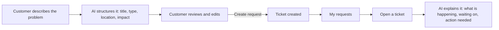
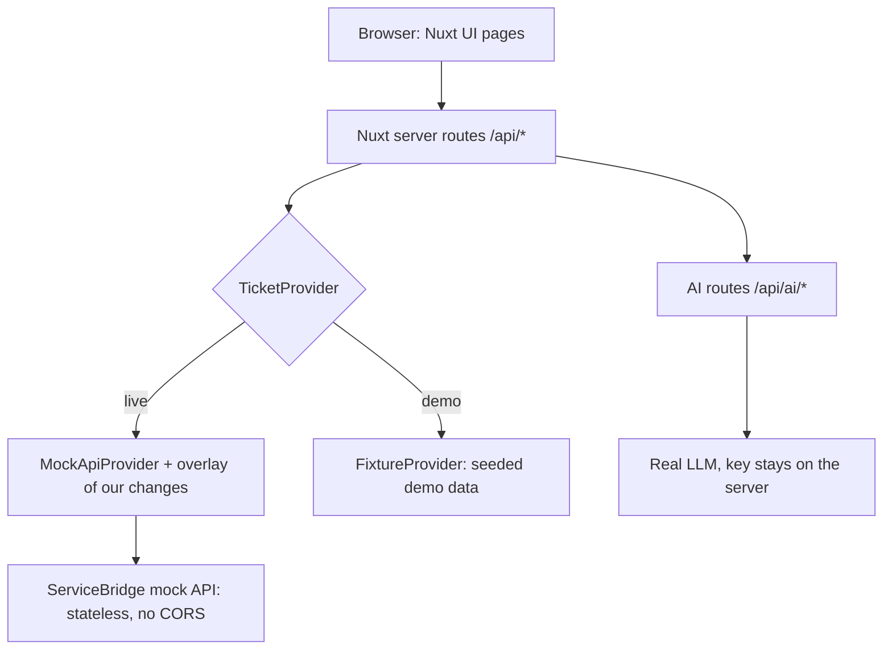

# TicketFlow AI

Our project for the **PragVue Hackathon 2026**, a 5-hour event to build a working Vue.js prototype. Topic: **AI-Powered Ticket Management Experience** (ServiceBridge).

> **Tagline:** Stop managing tickets. Just tell us what happened.

## Status

Preparation phase. The Nuxt starter is set up, docs and tickets are ready, and feature coding starts at kickoff (the hackathon rules require all coding to happen inside the 5-hour window). The final code must go into the Git repository the organizers assign to the team.

## The idea

A customer describes a problem in plain words. AI turns it into a structured ticket, and later explains what is happening on any ticket. Direction agreed on 2026-09-29: **customer-first**.

**The problem:** ticket systems make customers understand the system: complex forms, long threads, unclear status.

**What it does**

1. **AI ticket creator.** Type what happened. AI proposes title, description, type and location. The customer reviews, edits and clicks "Create request". If AI fails, the same form works manually.
2. **AI ticket summary.** Open a ticket with a long history and see what is happening, who it is waiting on, and whether you need to act.
3. **My requests.** A clear list with status, filters and search, and a detail view with a timeline.

Only after these are polished: what changed since your last visit, AI reply help, notifications.

**Principles:** AI is embedded in the flow, never a generic chatbot. AI content is labelled and editable, nothing is created until the customer confirms, and the app works without AI.

## Workflow

The customer journey:



How the app is built:



Why this shape: the mock API does not save writes and has no CORS, so the browser never calls it. Our server keeps an overlay of what we created, and a labelled demo-data mode keeps the demo working offline. Details: [docs/api/README.md](docs/api/README.md).

## Run the app

**You need:** Node 22 and pnpm (`corepack enable` sets pnpm up). **No Docker, no database.** The mock API is hosted by the organizers.

```bash
git clone git@github.com:chokonaira/PragHack.git
cd PragHack
pnpm install
cp .env.example .env      # then edit .env, never commit it
pnpm dev                  # http://localhost:3000
```

About `.env`:

- The defaults point at the organizers' mock API. Nothing else is needed to browse tickets.
- Set `NUXT_DEMO_MODE=true` to run on seeded demo data with no network.
- AI features need `NUXT_LLM_BASE_URL`, `NUXT_LLM_API_KEY` and `NUXT_LLM_MODEL`. Ask a teammate for the key. Never put a key in git.

| Command | What it does |
|---|---|
| `pnpm dev` | Dev server on port 3000 |
| `pnpm build` and `pnpm preview` | Production build and local preview |
| `pnpm lint` | ESLint |
| `pnpm typecheck` | Type check |
| `pnpm test` | Unit tests (exists after ticket T-02) |

Until ticket T-02 lands, the page you see is the Nuxt UI starter.

## Where to start

1. Read [CONTRIBUTING.md](CONTRIBUTING.md) (rules for every push: small, rebased, lint, typecheck and tests all pass, no failing test ever, no secrets).
2. Skim [SPEC.md](SPEC.md), [docs/contracts.md](docs/contracts.md), [DESIGN.md](DESIGN.md) and [docs/api/README.md](docs/api/README.md).
3. Pick a ticket in [TICKETS.md](TICKETS.md), write your name on it, push that line, then build.

## Docs map

| File | What it is |
|---|---|
| [CONTRIBUTING.md](CONTRIBUTING.md) | Trunk-based rules for every push |
| [SPEC.md](SPEC.md) | MVP scope, stories, success criteria, demo script |
| [TICKETS.md](TICKETS.md) | Tickets with done-checklists, plan, sign-off, sync log |
| [docs/contracts.md](docs/contracts.md) | Shared types, routes and AI response shapes |
| [docs/ai-samples.md](docs/ai-samples.md) | AI test samples and pass rules |
| [DESIGN.md](DESIGN.md) | Colours, themes, typography, motion, component and accessibility rules |
| [docs/WIREFRAMES.md](docs/WIREFRAMES.md) | Low-fidelity wireframes of the three key screens |
| [docs/api/README.md](docs/api/README.md) | Mock API spec for this repo, snapshots next to it |
| [docs/api-notes.md](docs/api-notes.md) | Extra API findings and corrections |
| [pragvue-ai-ticket-management-implementation-plan.md](pragvue-ai-ticket-management-implementation-plan.md) | Product plan |
| [CLAUDE.md](CLAUDE.md) | Instructions for AI coding agents |

## How the idea scores

| Category | Points | How we go for it |
|---|---|---|
| User Experience and Usability | 25 | Fast, keyboard-friendly, mobile and accessible, with loading, empty and error states |
| User and Business Value | 20 | One clear customer journey: describe, create, understand |
| Creativity, Innovation, and AI | 20 | AI embedded in the flow: creator, summary, reply help. Never a generic chatbot |
| Challenge Fulfilment | 20 | Use as much of the provided API as possible |
| Technical Quality | 10 | Clean structure, error handling, tests, no secrets in git |
| Final Presentation | 5 | Scripted demo with a backup mode in case the network fails |

## Live app

**https://ticketflow-hack.vercel.app** deploys automatically from every push to `main` (Vercel, connected to this repo). It runs in demo mode with seeded data and no AI key, so it is safe to share.

## Event links

- Portal (topics, announcements, registration): https://hackhub.pragvue.cz/
- Rules: https://hackhub.pragvue.cz/announcements/hackathon-rules
- Mock ticket API (ServiceBridge) Swagger: http://mockapi.pragvue.cz:8001/servicebridgeapi/docs

Topics: [Calendar](https://hackhub.pragvue.cz/topic/calendar-experience), [AI-Powered Ticket Management (ours)](https://hackhub.pragvue.cz/topic/ai-powered-servicebridge-ticket-experience), [Bring Your Own Idea](https://hackhub.pragvue.cz/topic/alternative-challenge-bring-your-own-idea). Each participant holds one registration at a time, and the ticket topic has 20 seats.

## Hackathon requirements to remember

- The main UI must be built with Vue.js. Vue 3 and TypeScript are recommended.
- Any libraries, APIs, backends and AI tools are allowed. We must explain how we used AI.
- Deliverables: source code in the assigned repo, a short README (description, features, stack, setup, configuration, AI tools used, known limitations), a working prototype, a live demo, and a 5-minute presentation.
- Mention significant pre-existing components or libraries in the presentation.

## Open decisions

Tracked in T-01 of [TICKETS.md](TICKETS.md): confirm the topic and register, Nitro proxy or server routes, LLM provider and key, the organizers' answer on the Nuxt starter and the final repo URL, roles.
