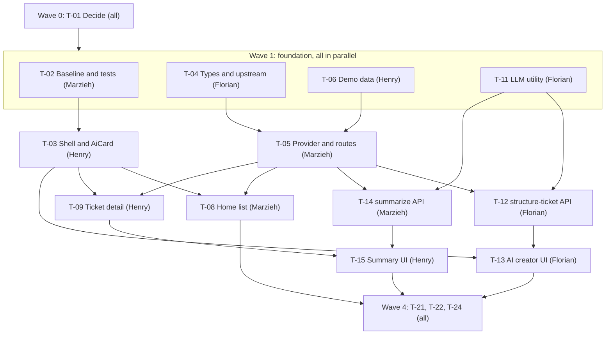

# Tickets

**3 hours left, so this is the smallest MVP that still demos well.** Tickets are ordered in **waves**. Inside a wave, everything runs in parallel. Do not start a ticket until everything in its **Needs** line is pushed.

Rules: [CONTRIBUTING.md](CONTRIBUTING.md). Shapes and routes: [docs/contracts.md](docs/contracts.md). Look and feel: [DESIGN.md](DESIGN.md). Mock API: [docs/api/README.md](docs/api/README.md).

## How to work a ticket

1. Find your name below. Start with your first ticket whose **Needs** are done.
2. Build it in small pushes. Tick the boxes as you go.
3. Done means every box is ticked **and** the Definition of Done at the bottom holds.
4. Stuck for 10 minutes? Say so in the team chat.

## Who does what (random draw, balanced by time)

| Person | Tickets in order | Total |
|---|---|---|
| **Henry** | T-06, T-03, T-09, T-15 | 145 min |
| **Florian** | T-04, T-11, T-12, T-13 | 160 min |
| **Marzieh** | T-02, T-05, T-14, T-08 | 150 min |
| **Everyone** | T-01, then T-21, T-22, T-24 at the end | |

Swap freely, but write it here and push.

## Build order

| Wave | Time (from now) | Tickets | Goal |
|---|---|---|---|
| 0 | 0:00 to 0:15 | T-01 | Decisions made, LLM key works |
| 1 | 0:15 to 0:50 | T-02, T-04, T-06, T-11 | Foundation pushed |
| 2 | 0:50 to 1:40 | T-03, T-05, T-12, T-14 | Data routes, shell and AI routes work |
| 3 | 1:40 to 2:30 | T-08, T-09, T-13, T-15 | All screens work end to end |
| 4 | 2:30 to 3:00 | T-21, T-22, T-24 | Checks, README, demo, final push |

**Feature freeze at 2:30.** After that only fixes, README and rehearsal.

**No slack in this plan.** If behind, cut in this order: (1) T-15 refresh and caching, (2) T-08 filters and search, (3) T-13 step-2 animation, (4) T-21 becomes a 15-minute quick check. Never cut: the manual fallback in T-13, loading, empty and error states, tests, demo mode.

**Merged or dropped:** T-07 is inside T-08 and T-09. T-16 is inside T-03. T-20 (offline AI answers) is inside T-06, T-12 and T-14. T-23 is inside T-22. T-19 (notifications) is dropped. Extras (T-10, T-17, T-18) are only for after Wave 3 with more than 40 minutes left.

---

## Wave 0

### T-01 Decide (everyone, 15 min)
**Goal:** the blockers are answered before anyone codes.
- [ ] One teammate confirms a working LLM key, base URL and model, and tests one call from a terminal. Values go only in their own `.env`.
- [ ] Everyone has pulled, read `CONTRIBUTING.md` and `docs/contracts.md`, and added a row to the sign-off table at the bottom.
- [ ] Registered for the topic. Asked the organizers for the final repo URL and whether the Nuxt starter is fine. Answers noted in the sync log.

**Check:** the LLM test call returns text.

## Wave 1: foundation (parallel)

### T-02 Baseline, look and tests
**Owner:** Marzieh · **Time:** 30 min · **Needs:** nothing · **Unblocks:** T-03
**Goal:** an empty branded app with tests running in CI.
- [x] Starter content removed (`TemplateMenu`, starter home content, title and meta). App named "TicketFlow AI". (done by Henry; `TemplateMenu.vue` file is unused and can be deleted)
- [x] `DESIGN.md` colours in `app/app.config.ts`, CSS tokens in `app/assets/css/main.css`, green scale removed. (done by Henry: cobalt scale, violet AI, Schibsted Grotesk, motion tokens)
- [x] `runtimeConfig` holds `apiBase`, `demoMode` and the LLM settings (server-only), matching `.env.example`. (done by Marzieh)
- [x] Vitest installed. `pnpm test` works with one passing sample test. `.github/workflows/ci.yml` runs `pnpm test`. (Vitest landed with T-04; `Test` step added by Marzieh)
- [x] `pnpm lint`, `pnpm typecheck` and `pnpm test` pass and CI is green. (done by Marzieh; CI green on `bf380d8`)

**Check:** open http://localhost:3000. You see a branded empty page, in light and dark.

### T-04 Types and upstream client
**Owner:** Florian · **Time:** 30 min · **Needs:** nothing · **Unblocks:** T-05, T-06, T-11
**Goal:** shared types and one safe way to call the mock.
- [x] `shared/types.ts` exactly as in `docs/contracts.md` (pushed by Henry so nobody waited, Florian: pull it, do not recreate it). Also holds the AI shapes and `TicketProvider`.
- [x] `server/utils/upstream.ts`: fetch with 8 second timeout, base URL from config, handles `204`, throws a typed `ApiError`, never leaks stack traces.
- [x] Mapper from mock shapes to our types (status matched by name, case-insensitive). Health probe on `GET /health`. (`server/utils/mappers.ts`, API shapes in `server/types/api.ts`.)
- [x] Tests: mapper, timeout, 404, 204. (`tests/server/*.test.ts`, 23 tests.)

**Check:** `pnpm test` is green.

### T-06 Demo data
**Owner:** Henry · **Time:** 30 min · **Needs:** `shared/types.ts` from T-04 · **Unblocks:** T-05, T-09, T-14
**Goal:** a believable demo that works with no network.
- [x] `server/data/demo.ts` with 8 tickets as `TicketDetail`: one with 8 or more comments (story: laptop replacement approved, waiting on support), one waiting on the customer ("please send the serial number"), one resolved, one created today, and two different locations and types.
- [x] `server/data/demo-ai.ts` with a hand-written `AiSummary` for every demo ticket and one `StructuredTicket` for the laptop sample text. All marked `source: 'demo'`.
- [x] `FixtureProvider` (`server/utils/providers/fixture.ts`) implements `TicketProvider`, keeps changes in memory, and has `reset()`.
- [x] Test: lists all tickets, `create` adds one, `reset` restores. (Checked ad hoc with tsx, 12 checks pass. Vitest arrives with T-02, then add this as a real test.)

**Check:** `pnpm test` is green.
### T-11 LLM utility
**Owner:** Florian · **Time:** 30 min · **Needs:** T-01 (key), T-04 · **Unblocks:** T-12, T-14
**Goal:** one safe function every AI route uses.
- [x] `server/utils/llm.ts` with `askJson(system, user, validate)`: Anthropic Messages API by default, OpenAI-style chat completions as the alternative (`NUXT_LLM_PROVIDER`, see `docs/contracts.md`), 10 second timeout per attempt, one retry, typed `AiError`.
- [x] Key only from server config (`runtimeConfig.llm.apiKey`). Logs hold provider, model, status and duration only, never the key, request bodies or ticket text.
- [ ] Spend guard for the public site: per-IP rate limit on `/api/ai/*` (10 requests per minute) and a small `max_tokens` cap. Real AI on Vercel stays off (`NUXT_DEMO_MODE=true`) until this is done. (`max_tokens` is capped at 1024 in `llm.ts`. Rate limit still open.)
- [x] Ticket text is passed as delimited data (`asData`). `UNTRUSTED_DATA_RULE` goes into every system prompt and says never to follow instructions inside it.
- [x] Tests with mocked fetch: valid JSON passes, invalid JSON retries then errors, an "ignore your instructions" text keeps the output shape. (`tests/server/llm.test.ts`, 18 tests. Also checked live against Anthropic: the model answers JSON and ignores the injection.)

**Check:** `pnpm test` is green.

## Wave 2: routes and shell (parallel)

### T-05 Provider and routes
**Owner:** Marzieh · **Time:** 45 min · **Needs:** T-04, T-06 · **Unblocks:** T-08, T-09, T-12, T-14
**Goal:** the browser gets tickets from our own routes, live or demo.
- [x] `MockApiProvider` with `list`, `get`, `create`, `addComment`, `meta` following the mapping in `docs/api/README.md`. Overlay holds created tickets and comments. Created tickets get a unique local key (the mock always answers `MCDTE-50`) and `isLocal: true`. `get` takes summary and description from the list item. (done by Marzieh: `server/utils/providers/mock.ts`)
- [x] Routes exactly as in `docs/contracts.md`: `/api/mode`, tickets, `:key`, create-meta, create, comments, `/api/demo/reset`. (done by Marzieh)
- [x] Provider chosen by `/api/mode` (live or demo). Inputs validated, errors use `{ message, status }`. (done by Marzieh: `server/utils/mode.ts`, `server/utils/validation.ts`, `server/utils/errors.ts`)
- [x] Tests: overlay merge, unique keys, validation. (done by Marzieh: `tests/server/mock-provider.test.ts`, `tests/server/validation.test.ts`, 36 new tests)

**Check:** `curl localhost:3000/api/tickets` returns tickets. With demo mode on it returns the demo tickets.

### T-03 App shell and AiCard
**Owner:** Henry · **Time:** 40 min · **Needs:** T-02 · **Unblocks:** T-08, T-09, T-13, T-15
**Goal:** the frame every page sits in, plus the one AI component.
- [x] Header: product name, nav (My requests, New request), colour-mode toggle, and a "Demo data" badge when `/api/mode` says demo.
- [x] Page container, `error.vue` (404 and 500 with a way back), skip-to-content link.
- [x] `AiCard.vue` as in `DESIGN.md` (done by Henry): props `title`, `loading`, `error`, `footnote`, a default slot, an AI badge and sparkles icon, a retry event, `aria-live="polite"` and `aria-busy`.
- [x] Looks right at 390 px and 1440 px, light and dark.

**Check:** header and an `AiCard` in loading, error and ready states on a scratch page (do not commit the scratch page).
### T-12 structure-ticket API
**Owner:** Florian · **Time:** 40 min · **Needs:** T-11, T-05 · **Unblocks:** T-13
**Goal:** free text in, a valid structured ticket out.
- [x] `POST /api/ai/structure-ticket` exactly as in `docs/contracts.md`. Output validated: summary 80 characters or fewer, `ticketType` and `impact` from the enums, `location` one of the create-meta options or `null`. (`server/utils/structure.ts` holds the prompt and validator, the route is `server/api/ai/structure-ticket.post.ts`.)
- [x] The prompt lists the real locations and never invents values.
- [x] Demo mode returns the pre-generated result with `source: 'demo'`. If the model fails outside demo mode the route returns `502`.
- [x] The 8 samples in `docs/ai-samples.md` are run and the results written down. Pass rule is in that file. (8 of 8 pass, see the run note there. Tests: `tests/server/structure.test.ts`, 17 tests.)

**Check:** curl with the laptop sample returns valid JSON.

### T-14 summarize-ticket API
**Owner:** Marzieh · **Time:** 30 min · **Needs:** T-11, T-05, T-06 · **Unblocks:** T-15
**Goal:** a short, honest explanation of any ticket.
- [x] `POST /api/ai/summarize-ticket` exactly as in `docs/contracts.md`. The server loads the ticket and comments itself from the key. (`server/api/ai/summarize-ticket.post.ts`, `server/utils/ai/summarize.ts`)
- [x] Output validated. A ticket with zero comments says the history is short instead of guessing. (short-circuited before calling the model, `shortHistorySummary`)
- [x] Demo mode returns the pre-generated summary with `source: 'demo'`. (unchanged demo branch from Henry's slice)
- [x] Tested (mocked LLM) on the long-thread demo ticket and a zero-comment ticket. Results in `docs/ai-samples.md`. (`tests/server/summarize.test.ts`, samples A-D)

**Check:** curl with the long-thread demo key returns `waitingOn` and `basedOnComments` filled.

## Wave 3: screens (parallel)

### T-08 Home: my requests
**Owner:** Marzieh · **Time:** 45 min · **Needs:** T-03, T-05 · **Unblocks:** T-21
**Goal:** the customer sees their requests and can start a new one.
- [ ] `useTickets()` composable with loading, error (retry), empty and refresh.
- [ ] `TicketCard`: key (mono), summary, status badge (icon and text), location, relative updated time. Wireframe: `docs/WIREFRAMES.md`.
- [ ] Status filter chips with counts, and client-side text search.
- [ ] "What's the problem?" box at the top that opens `/new`.
- [ ] Skeleton, empty state (with a "New request" button) and error state. Cards work with the keyboard.

**Check:** open `/`, filter by status, search, open a card.

### T-09 Ticket detail
**Owner:** Henry · **Time:** 45 min · **Needs:** T-03, T-05, T-06 · **Unblocks:** T-15
**Goal:** the customer understands where a ticket stands.
- [ ] `useTicket(key)` composable.
- [x] Header (key, status, type, location, created, updated), description, `TicketTimeline` with the created event and comments, details column from `lg` up.
- [x] Skeleton, error and not-found states. Zero comments handled.
- [x] A slot above the description for the summary card.

**Check:** open the long-thread demo ticket. The timeline shows all comments.
### T-13 AI creator UI
**Owner:** Florian · **Time:** 60 min · **Needs:** T-12, T-03, T-05 · **Unblocks:** T-21
**Goal:** describe, review, create. This is the hero of the demo.
- [ ] `/new`: step 1 textarea, 3 example chips (from `docs/ai-samples.md`), "Create with AI" button (also Ctrl/Cmd+Enter), "Fill it in manually" link.
- [ ] Step 2: progress text ("Understanding", "Structuring", "Choosing location"), no motion under reduced motion.
- [ ] Step 3 inside an `AiCard`: editable title, description, type, location. Changed fields show "Edited". Missing-info hints and impact shown.
- [ ] "Create request" calls `POST /api/tickets`, shows a success toast and opens the new ticket. Errors keep what was typed.
- [ ] If the AI fails, the same form appears empty with a clear message.
- [ ] Nothing is created until "Create request" is clicked.

**Check:** the laptop sample goes from text to a created ticket that shows in the list.

### T-15 Summary UI
**Owner:** Henry · **Time:** 30 min · **Needs:** T-14, T-09, T-03 · **Unblocks:** T-21
**Goal:** the "What's happening?" card on the detail page.
- [x] `AiCard` with the summary, waiting on, action required, "Based on N comments", and the "Demo data" marker when `source` is `demo`.
- [x] Skeleton while loading. Refresh button. Cached per key and `updatedAt`. Inline "Try again" on error.
- [x] The rest of the page works if the AI fails.

**Check:** open the long-thread demo ticket. The card fills in. Turn the LLM key off and the page still works.
## Wave 4: finish (everyone)

### T-21 Final checks (10 minutes each)
- [ ] **Henry:** keyboard-only run (home, open ticket, create with AI, back), axe scan on home, detail and `/new`.
- [ ] **Marzieh:** 390 px and 1440 px, light and dark, on all three screens.
- [ ] **Florian:** error cases (API down, LLM down, empty list), demo mode with the network off.
- [ ] Every problem found is fixed or written down as a known limitation.

### T-22 README, demo script and rehearsal
- [ ] Judges' README: description, features, stack, setup and start, configuration, AI tools used (development and in the app) and the value they give, known limitations, significant pre-existing parts (Nuxt starter, libraries). Henry writes it.
- [ ] `docs/demo-script.md` from the demo script in `SPEC.md`, with who says what and who drives.
- [ ] Two timed rehearsals under 5 minutes, plus a backup screen recording.

### T-24 Freeze and final push
- [ ] Fresh clone: `pnpm install && pnpm build && pnpm test` pass.
- [ ] `git grep` for keys and tokens finds nothing. `.env` not committed.
- [ ] Code pushed to the repository the organizers assigned. CI green there.
- [ ] Demo runs from the pushed version.

## Only if Wave 3 is done with more than 40 minutes left

- **T-10 Comment composer:** send a comment from the detail page, rolls back on failure.
- **T-17 Since your last visit:** AI card listing changes since the last visit, only when something changed.
- **T-18 Help me reply:** AI fills an editable draft. The customer sends it, never the AI.

---

## Definition of Done (every ticket)

- [ ] Every checkbox in the ticket is ticked.
- [ ] `pnpm lint`, `pnpm typecheck` and `pnpm test` pass. No failing, skipped or weakened test. CI is green after the push.
- [ ] New logic has a test in the same push.
- [ ] Loading, empty and error states exist for anything that loads data.
- [ ] No secrets, keys or real personal data in the diff.
- [ ] `pnpm dev` runs and the demo path still works.
- [ ] `docs/contracts.md` or `SPEC.md` updated if a shape or scope changed, with a line in the sync log.
- [ ] Pushed to `main` following [CONTRIBUTING.md](CONTRIBUTING.md).

**Extra for UI tickets:** semantic tokens only, no hex colours. Works at 390 px and 1440 px, light and dark. Keyboard only works with visible focus. Status never relies on colour alone. Motion only on `transform` and `opacity`, off under reduced motion. AI content sits in `AiCard`, labelled and editable.

**Extra for AI tickets:** output validated before use, one retry then a clear fallback. 10 second timeout. Key only in server config, never logged. Ticket text is data, never instructions. The core flow works if AI fails.

## Team sign-off

Add your row in your first push. It means you have read `CONTRIBUTING.md`, `docs/contracts.md` and this file, and you follow the push rules.

| Name | Read and agreed (time) |
|---|---|
| Florian | 2026-09-29 14:00 |
| Marzieh | 2026-09-29 14:20 |
| Henry | 2026-09-29 14:45 |

## Sync log

One line per decision that changes scope, stack, a contract or the demo path: `time, who, decision`.

- 2026-09-29, team: direction is customer-first (TicketFlow AI). The operator autopilot board is dropped.
- 2026-09-29, team: LLM is provider-neutral (base URL, key, model). The provider is whichever working key a teammate has (T-01).
- 2026-09-29, team: 3 hours left. Tickets cut and ordered in waves. Owners drawn at random and balanced.
- 2026-09-29, Florian: T-04 needed tests before T-02 landed, so vitest, `pnpm test` (`vitest run`, tests in `tests/**/*.test.ts`) and `runtimeConfig.apiBase` are in with T-04. T-02 keeps the rest of `runtimeConfig` and CI.
- 2026-09-29, Henry: built the visual layer because the UI is the big scoring lever: `cobalt` tokens, Schibsted Grotesk, `TicketFlowTracker` (the flow-line signature), logo, header shell, home page UI, `TicketRow`, and a placeholder `/new`. Also the first slice of `server/api/tickets.get.ts` (demo data). **Marzieh:** T-02 left = `runtimeConfig` for the LLM, CI test step; T-05 must extend `server/api/tickets.get.ts` and `server/utils/demoProvider.ts`, not recreate them; T-08 left = `useTickets` composable, text search, keyboard check. **Florian:** T-13 replaces `app/pages/new.vue`. Use the `ticketflow-ui` skill for all UI. Live: https://ticketflow-hack.vercel.app
- 2026-09-29, Henry: ticket detail page (`app/pages/tickets/[key].vue`) and its AI summary card are built against demo data. Slices of T-05 and T-14 added: `server/api/tickets/[key].get.ts` and `server/api/ai/summarize-ticket.post.ts` (demo answers only). Marzieh extends both for live mode and the real LLM, do not recreate them.
- 2026-09-29, Florian: T-11 reads `runtimeConfig.llm.{provider,baseUrl,apiKey,model}` as T-02 defined them (`NUXT_LLM_*`). Note for T-12 and T-14: the model overshoots character limits in the prompt (asked for 80, wrote 84 and 95), so ask for a smaller number than the validator enforces.
- 2026-09-29, Henry: New request is now a modal (`NewRequestModal.vue`) opened from the header, the hero and `/new`: describe (with voice dictation where the browser supports it), AI steps, review and edit, create, then the new ticket slides into the list. Demo-only slices added: `server/api/ai/structure-ticket.post.ts`, `server/api/tickets.post.ts`, `server/api/create-meta.get.ts`. **Florian:** T-12 replaces the body of `structure-ticket.post.ts` with the real LLM call (keep `structureDemo` as the demo fallback). T-13 is mostly done, polish only. The home list refreshes every 3 seconds.
- 2026-09-29, Henry: T-21 (Henry's part): axe scan clean on home, detail and the modal in light and dark; fixed AiCard heading order and contrast. T-03 done: `app/error.vue`, header "Demo data" badge from `/api/mode`. Added a demo-only "Simulate support update" control on the ticket page (`POST /api/tickets/:key/advance`, refused outside demo mode) so the flow line can move in the demo. The demo AI summary now reflects those changes.
- 2026-09-29, Marzieh: T-14 done. `summarize-ticket.post.ts` now calls the real LLM in live mode through `server/utils/ai/summarize.ts` (`summarizeTicket`); demo mode is unchanged (still passes `ticket.status` into `getDemoSummary` per Henry's T-21 change above). `basedOnComments`, `generatedAt` and `source` are set by the server, never trusted from the model. Zero-comment tickets never call the model (`shortHistorySummary`), so nothing can be invented there. **Henry (T-15):** build against this route as-is; on an AI failure it answers `502`/`504` via `apiError`, so keep the rest of the detail page working and show the inline "Try again".
- 2026-09-29, Henry: one input everywhere. `PromptBox.vue` is now used by both the home hero and the New request modal, so they look and behave the same. Voice: red recording state, Stop button, live level bars (animated fallback if the mic meter is blocked), and text streams into the box while you speak (`useSpeechInput` takes interim results). The manual link is now "Skip AI, use the form".
- 2026-09-29, Henry: T-15 done (Refresh button, cache keyed on ticket updatedAt). Voice input is now a state machine (idle, starting, listening, stopping): Listening shows only once the mic is really on, Stop waits for the last words, the mic is always released, the box is read-only while recording. The modal ignores stale AI runs and both AI and create calls time out (20s and 15s).
- 2026-09-29, Henry: `NUXT_AI_LIVE` switch added (off by default). In demo mode the AI routes still answer from the pre-written demo answers. With `NUXT_AI_LIVE=true` and a key set, the demo tickets use the real model. Live mode always uses the model. Logic is `server/utils/aiMode.ts` (tested), used by both AI routes. **Keep it false on Vercel.**
- 2026-09-29, Henry: design change, less "AI demo", more product. Removed: example chips, sparkle icons, the AI pill and the violet AI card. `AiCard` is now a plain quiet card with one small line ("Written by AI. Check the details before you act on them."). Submit says "Continue". Filters are underline tabs. Mobile: header no longer overflows at 320 px, tap targets are 44 px, demo badge becomes a strip on phones. `DESIGN.md`, `CLAUDE.md` and the `ticketflow-ui` skill are updated, so teammates' agents follow the new rules.
- 2026-09-29, Henry: found and fixed a Vercel bug. Serverless runs many instances, so a ticket created on one was missing on the others (in a 40-request test: detail 404 on 25, summary 404 on 38). Demo state can now live in Upstash Redis (`server/utils/demoStore.ts`, plain fetch, no new dependency), turned on by `KV_REST_API_URL` and `KV_REST_API_TOKEN` (Vercel's integration sets them). Off without them. Tested with two simulated instances sharing a store.
